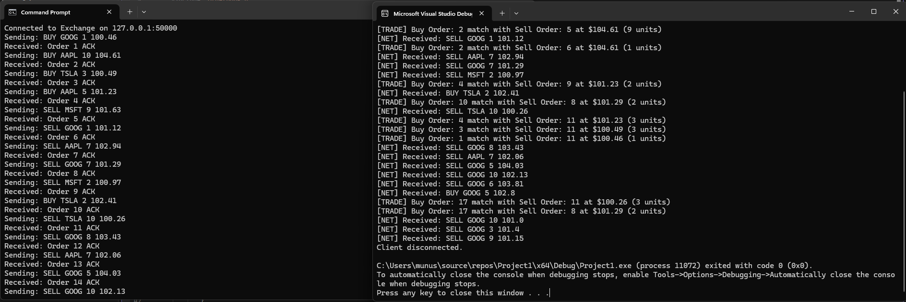

C++ Limit Order Book \& Matching Engine

\_\_\_\_\_\_\_\_\_\_\_\_\_\_\_\_\_\_\_\_\_\_\_\_\_\_\_\_\_\_\_\_\_\_\_\_\_\_\_\_

I built this high-performance Order Matching Engine to understand how financial exchanges like the NASDAQ work under the hood. It simulates a real-world trading system that accepts orders via TCP, matches them using Price-Time Priority, and executes trades in real-time.

While I have built smaller C++ programs before, this was my first deep dive into Network Programming (Winsock) and Thread-Safety.

Key Features

•	Core Matching Logic: Implements a Limit Order Book (LOB) using std::map to handle Bid/Ask matching. I chose std::map because it keeps orders sorted automatically (O(log N)), which is critical for finding the best price quickly.

•	Multithreading: Uses a Producer-Consumer architecture. The matching engine runs on its own thread so it never blocks the network thread while waiting for new orders.

•	Thread Safety: I implemented a custom Thread-Safe Queue using std::mutex and std::condition\_variable to prevent race conditions between the network and engine threads.

•	Networking: Built a custom TCP Server using Winsock API to accept orders from external clients.

•	Protocol: Designed a simple text-based protocol (BUY/SELL TICKER AMOUNT PRICE) to simulate how traders send data to an exchange.

Tech Stack

•	Language: C++17

•	Networking: Winsock2 (Windows Sockets) / TCP/IP

•	Concurrency: std::thread, std::mutex, std::condition\_variable

•	Build System: CMake

•	Testing: Python (Client-side scripts for stress testing)

Architecture

The system consists of two distinct executables that talk to each other:

1\.	Exchange Server (C++): The core engine that listens on Port 50000 and matches trades.

2\.	Trading Client (Python): A script that simulates a High-Frequency Trading (HFT) firm sending random buy/sell orders to stress-test my engine.

Challenges \& What I Learned

This project was a major learning curve for me. Here are the specific hurdles I overcame:

•	Race Conditions: My program initially crashed because two threads tried to access the order book at the same time. I learned to use std::unique\_lock to protect shared data.

•	Networking: Getting C++ to understand text messages from Python was tricky. I had to manually parse the string buffers and handle edge cases where messages might get split.

•	Memory Management: I focused on passing objects by reference to avoid unnecessary copies, making the engine more efficient.

Acknowledgments

•	AI Assistance: I used an AI assistant (Gemini) as a "pair programmer" to help me troubleshoot complex linker errors with CMake and to better understand the nuances of the Winsock library.

How to Build \& Run

Prerequisites

•	C++ Compiler (MSVC)

•	CMake (3.10+)

•	Python 3 (for the client)

Build

mkdir build

cd build

cmake ..

cmake --build .

Running the Simulation

1\.	Start the Server:

./server.exe

2\.	Start the Client (in a separate terminal):

python trade\_script.py

Sample Output

Server Side:

>> Client connected!

\[NET] Received: BUY AAPL 10 104.61

\[NET] Received: SELL AAPL 5 101.23

\[TRADE] Buy Order: 2 matched with Sell Order: 5 at $104.61 (5 units)

Client Side:

Connected to Exchange on 127.0.0.1:50000

Sending: BUY AAPL 10 104.61

Received: Order 1 ACK

## Demo

